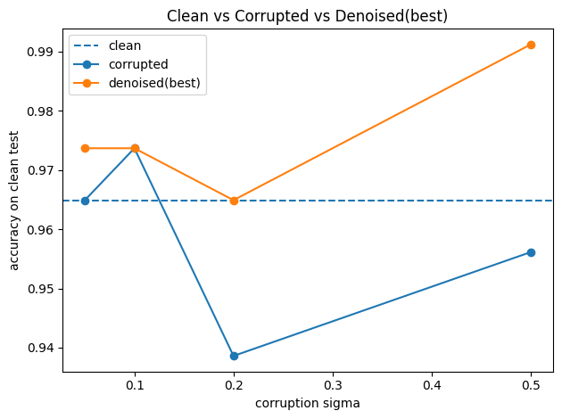

# Tabular DDPM for Robust Breast Cancer Classification

An exploratory study of whether a denoising diffusion probabilistic model
(DDPM) can restore noisy tabular features and improve downstream breast cancer
classification.



## Project Question

Can a diffusion model trained on clean tabular data recover useful signal from
noise-corrupted training features?

## Dataset

- Wisconsin Diagnostic Breast Cancer dataset
- 569 samples and 30 numeric features
- Binary diagnosis target
- Stratified 80/20 train-test split: 455 training and 114 test samples
- Gaussian noise evaluated at `sigma = 0.05, 0.10, 0.20, 0.50`

## Approach

1. Impute and standardize numeric features using training-set statistics.
2. Add controlled Gaussian noise to the standardized training features.
3. Train a Gradient Boosting classifier on clean and corrupted data.
4. Train a tabular DDPM on clean training features.
5. Denoise corrupted features across candidate reverse-diffusion start steps.
6. Retrain the classifier on denoised features and compare test accuracy.

## Key Results

| Noise sigma | Corrupted accuracy | Best denoised accuracy | Best start step |
| ---: | ---: | ---: | ---: |
| 0.05 | 96.49% | 97.37% | 0 |
| 0.10 | 97.37% | 97.37% | 84 |
| 0.20 | 93.86% | 96.49% | 64 |
| 0.50 | 95.61% | **99.12%** | 94 |

The clean-data baseline accuracy was **96.49%**. DDPM denoising recovered the
clean baseline at `sigma = 0.20` and produced the highest observed accuracy at
`sigma = 0.50`.

## Model Configuration

- DDPM diffusion steps: 500
- Noise-prediction network: three-layer MLP, 256 hidden units
- Sinusoidal timestep embedding: 128 dimensions
- Training steps: 3,000
- Batch size: 128
- Optimizer: Adam, learning rate `1e-3`
- Downstream model: Gradient Boosting classifier

## Repository Structure

```text
.
|-- src/
|   `-- tabular_ddpm.py
|-- results/
|   |-- figures/
|   `-- summary.csv
|-- .gitignore
|-- README.md
`-- requirements.txt
```

## Limitations

- Results use one fixed train-test split and require cross-validation for a
  stronger performance estimate.
- The best reverse-diffusion start step was selected through a parameter sweep.
- Accuracy alone is insufficient for clinical evaluation; sensitivity,
  specificity, ROC-AUC, and calibration should also be assessed.
- This is an educational and exploratory analysis, not a clinical diagnostic
  system.

## Tools

Python, PyTorch, pandas, NumPy, scikit-learn, and Matplotlib.

